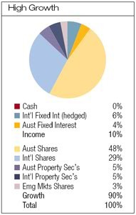

Asset allocation or risk profiling in necessary before you do any investing. This is usually a short test where your answers provide insight into what kind of investor you are and how comfortable with risk you are.

Some web sites have risk calculators where you can do the risk profiling yourself. Or, simply check some of the risk profiles below.

My preferred risk profile / asset allocation is distributed 60:40 between defensive and growth assets.

	
The latest ratio is:

- 55% Equity (20% domestic, 20% international, 15% small cap)
- 35% Fixed Income (13% domestic, 13% international, 9% cash)
- 10% Real Estate (diversified)

	
	
And, within the groups above, the further sub-division is shown in the 
	chart to the left. 
	Stocks/mutual funds are diversified in Australian and International markets, 
	Australian property and small companies. Bonds are distributed in 60:40 ratio between International 
	and Australian bonds.

To check your risk profile, try Vanguard's [Investor Questionnaire](https://personal.vanguard.com/us/FundsInvQuestionnaire).

###### Typical Risk Profiles ######

Conservative, Balanced, Aggressive/Growth

See article on diversification ([link](http://www.schwab.com/public/schwab/resource_center/expert_insight/investing_strategies/portfolio_planning/the_portfolio_pyramid_how_to_diversify_your_investments.html)) from Schwab for more details.

It is now available [here](http://www.investnbest.com/The%20Portfolio%20Pyramid.doc)

##### Vanguard risk profiles #####

<h6>Defensive Investing</h6>

Read <a href="http://alensfinance.blogspot.com/2009/01/defensive-assets-rule-of-thumb.html">
Defensive Assets - Rule of Thumb</a> article stating a general rule on investing in bonds.

