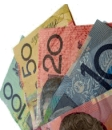

There are four major local banks in Australia. You may often hear a term &#39;four pillars&#39;. A couple of others were rising quickly in 2000&#39;s. Those that grew enough were purchased by the major banks. In May 2008 WestPac announced purchasing StGeorge, the fifth largest bank in Australia. In October 2008 Commonwealth Bank of Australia announced purchase of BankWest.
 
My current everyday bank is <a href="#HSBC">here</a>. The list of best known banks is below.

###### My Favourites

##### <a name="HSBC">HSBC</a> #####

* [Homepage](http://www.hsbc.com.au/)
* [Online Banking](http://www.hsbc.com.au/1/2/HUB_IDV2/IDV_EPP?__IWCountry=US&amp;__IWLang=en&amp;__Destination=HUB_IDV_CUSTOMER_MIGRATION&amp;__menuType=__REGISTRATION&amp;__registrationType=PIB-Registration)
* <a target="_blank" href="http://www.banking.hsbc.com.au/utility/locations/atm.html#vic">ATM/Branch 
locator</a>
* <a href="http://www.banking.hsbc.com.au/utility/rates/ausdollar.html">Rates</a>

##### SunCorp

* Internet banking (<a href="https://internetbanking.suncorpbank.com.au/" target="_blank">link</a>)

###### The Big Four

##### ANZ - Australia and New Zealand Banking Group Limited

##### CBA - Commonwealth Bank of Australia #####

* BankWest <a target="_blank" href="https://ibs.bankwest.com.au/BWLogin/rib.aspx">Internet Banking</a>

##### NAB - National Australia Bank #####

* <a href="http://www.ubank.com.au/ub/web/home" target="_blank">UBank</a>

##### WBC - WestPac Banking Corporation #####

* <a href="http://www.westpac.com.au/">web site</a>
* <a target="_blank" href="https://online.westpac.com.au/esis/Login/SrvPage">Westpac Internet Banking</a>
* <a target="_blank" href="http://www.nowwhereroute.com/Westpac/LocateUs/Australia/default.aspx">Locator</a>
* <a target="_blank" href="http://www.nowwhereroute.com/Westpac/LocateUs/ATMLocator/default.aspx">ATM Locator</a>
* <a target="_blank" href="http://www.westpac.com.au/internet/publish.nsf/content/pbts%20debit%20mastercard">Debit MasterCard</a>
* <a target="_blank" href="http://www.westpac.com.au/internet/publish.nsf/Content/PB+Todays+Rates">Rates</a>
* [StGeorge](http://www.stgeorge.com.au/) ● [Direct Saver](https://ibanking.stgeorge.com.au/ibank/loginPage.action) online banking

###### Other Banks ######

##### AMP #####

* [AMP](http://www.amp.com.au)

##### Arab Bank Australia #####

<ul>
	<li><a href="http://www.arabbank.com.au/" target="_blank">web site</a></li>
	<li>
	<a href="https://online.arabbank.com.au/internetbanking/" target="_blank">online banking</a></li>
</ul>

##### Bank of Queensland #####

* <a href="http://www.boq.com.au" target="_blank">Web Site</a>

##### CitiBank #####

* CitiBank

##### Elders Rural Bank #####

* <a href="http://www.erbonline.com.au/" target="_blank">web site</a>

##### GE Money #####

See [Credit Cards](aus_creditcards.html).

##### ING #####

* <a href="http://www.ing.com.au/">ING</a> web site
* ING <a href="http://www.ingdirect.com.au/">Direct</a>

##### Members Equity Bank #####

* [MEB](http://www.mebank.com.au/) web site
* [online banking](https://ib.mebank.com.au/ME)

##### myState Financial #####

* [Web Site](http://www.mystate.com.au/)

##### RaboBank Australia #####

* <a href="http://www.rabodirect.com.au/" target="_blank">Web Site</a>
* <a href="https://secure.rabodirect.com.au/exp/authenticationDGPEN.jsp" target="_blank">Online 
banking</a>
