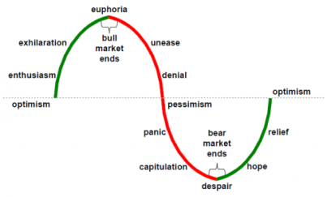
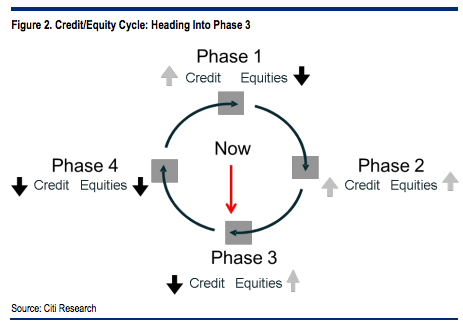
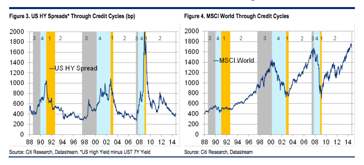

Here is a collection of views on investment phases, or business/market cycles.

###### Market Cycle

Below is a typical chart of a market cycle.

###### Citi 

These were published in August 2014 in several newspapers and blogs so the "Now" arrow should refer to mid-2014.

